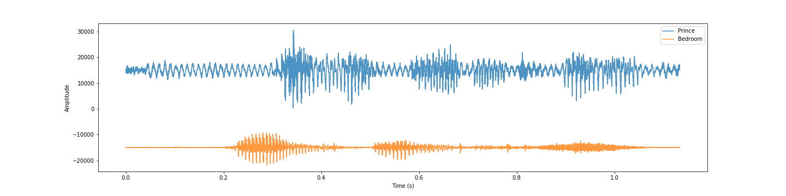
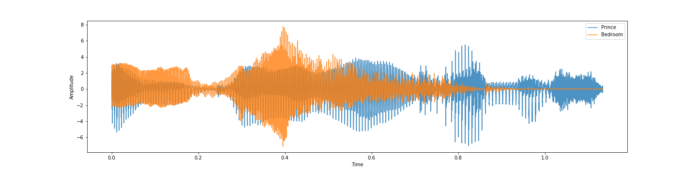
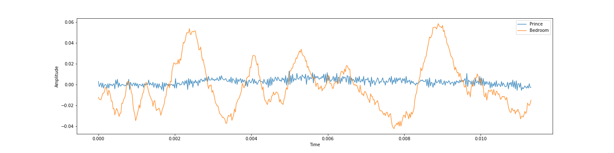
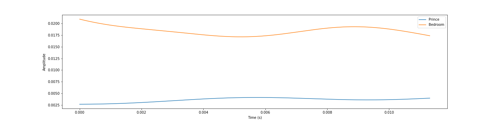
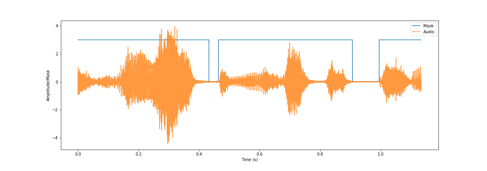
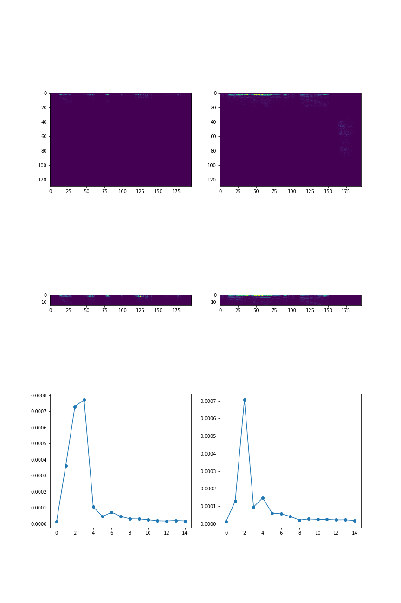

# Vocal Recognizer 

---

In this project we are going to follow step-by-step the creation of a Machine Learning Model.
Our goal is to recognize the person that is talking in real-time based on the training data given to the model.
For this reson we chose to use 2 audio tracks that we found on Youtube long about 20 minutes.

The first one is the one we called Prince in the Python Code.
* https://www.youtube.com/watch?v=zKtdVseMNAM

The second one is the one we called Bedroom in the Python Code.
* https://www.youtube.com/watch?v=6nA_Je_8i-U&t=1168s

---

## Loading Data from Youtube videos

We downloaded these two videos using an online converter to WAV file in order to have an easier data usage.

After we downloaded the files we imported into Python using Scipy through its module called wavfile.

```python
from scipy.io import wavfile

fs, prince = wavfile.read(f'{root}Audio/prince.wav')
fs, bedroom = wavfile.read(f'{root}Audio/bedroom.wav')

```

The method returns both the frequency of the audio and the audio its self.
In our case the frequency was 44100 Hz.
Instead the Audio lenght was about 52 million so next thing we are going to do is reduce these in order to well-fit the Model.

---

## Data Scaling

Before starting the real adjustment we reduced both the tracks to be 20 minutes long.

```python

bedroom_difference = bedroom.size - 20*60*fs
bedroom = bedroom[bedroom_difference:]
prince_difference = prince.size - 20*60*fs
prince = prince[prince_difference:]

```
That expression "20 * 60 * fs" is used get the difference between the original file lenght and 20 minutes which is our goal, 20 * 60 to get the total amount of seconds and then we multiplied by the frequency.

The first thing that we've looked at is the volume of the tracks and we found out that one is louder than the other so we applied a scaler from the sklearn library to scale the raw audio.

Why we couldn't just use the original volume? 
The reason is becouse the Model will predict with high accuracy basing on the volume of the speaker and not basing on the tone. 

```python
from sklearn.preprocessing import StandardScaler

scaler = StandardScaler()

prince = scaler.fit_transform(prince.reshape(-1, 1)).flatten()
bedroom = scaler.fit_transform(bedroom.reshape(-1, 1)).flatten()
```

Next you can look at the plots visualizing the Audio before and after the scaling process.

  ## Raw


__Offset between blue and orange track for visualization purpose__ 

  ## Scaled


---

# Data Filtering

Now look at a little portion of the Scaled Data.



As you can see it is very irregular and this may cause the Model to not be able to fit adequately, so we are going to appply to the entire data a *Gaussian Filter* using Scipy, before doing that we need to make the track have its mean value to 0 and then to overturn the negative values over the X axis wich we did using *np.mean* and *np.abs*.

```python

from scipy.ndimage import gaussian_filter

filtered_prince = gaussian_filter(np.abs(prince - np.mean(prince)), 100)
filtered_bedroom = gaussian_filter(np.abs(bedroom - np.mean(bedroom)), 100)

```

This is the result in the same portion of the file.



Now we are close to the actual training time, we need to do only few more things in fact our file is very large right now so we have to reduce it, lastly we need to divide it in small batches.

---

# Data Reduction 

We are going to reduce the dimension of the file and we are going to divide it in batches, so how do we do it?
First let's focus on the audio its self, during a talk there are breaks between each word wich are useless in term of recognizing who is talking  so we need to remove all the pauses that are inside a 20 minutes talk.
To do so we define a variable called cut_silence and set it to a value that is able to remove the silence and at the same time keep all the words intact.
We then make a mask, which is basically an array with the same shape of the original audio filled with 0 and 1, 0 where the audio is less than the treshold and 1 when it's greater than it.
Once we have our mask we apply it to the original audio to remove the silence between each word.

```python

  data_prince = pd.Series(np.where((filtered_prince>cut_silence)==1, prince, None))
  data_bedroom = pd.Series(np.where((filtered_bedroom>cut_silence)==1, bedroom, None))

  data_prince = data_prince.dropna(axis=0)
  data_bedroom = data_bedroom.dropna(axis=0)
  
  data_prince = data_prince.as_matrix()
  data_bedroom = data_bedroom.as_matrix()

  
  data_prince = np.asarray(data_prince, dtype=np.int16)
  data_bedroom = np.asarray(data_bedroom, dtype=np.int16)

```

So let's talk about the code:
In the first part we created a *Pandas Series* that is going to help us removing None values from the array.
We used Numpy's method *where* to place the original value if the filtered audio is greater than the treshold instead we are placing None if it's not.
After this we have an array that looks like this: ``` [..., 5.3, 4,6, None, None, None, 8.3, 1.2, 0.4, None, ...] ```

So we are using a Series method called *dropna* to remove all the *None* values from it.
This image will show the correlation between the Audio and the Mask.
Where you see the blue line(Mask) high it means that the result will keep the corrispective of the orange track, instead, the orange part will be cancelled if the blue line is low.



The next instruction are used to convert our Series back to a *numpy array* with datatype equals to *16bit*.
Why do we need it to be 16 bit instead of 64?
It's because our original audio is 16 bit.

Just using this mask our original audio reduced from 20 to 16 minutes, big difference!
We saved about 10 million values from our original array, this will heavly reduce the time used to compute this massive array. 

---

# Data Batching 

Now that we have our data ready for the training we need to divide it in batches.
We decided to create *batches 1 second long* but we could have decided to have 2 seconds or even 0.5 seconds.
The problems with batches of 2 seconds and 0.5 seconds is the dimension of the batch it self and the total number of batches.
In the first case we would have less batches but each of them would have a big quantity of information inside.
In the second case we would have smaller batches but we would compensate with the number of batches.
In our opinion 1 second is the right choice to have an acceptable number of batches each of them with an acceptable quantity of information.
Think about it, would you be capable to recognise one of your friends in just 0.5 seconds?

Let's get into the code.

```python
  batch_size = batch_seconds*fs  

  data_prince = data_prince[:-(data_prince.size%batch_size)]
  data_bedroom = data_bedroom[:-(data_bedroom.size%batch_size)]
  
  size_batch_prince = int(len(data_prince) / batch_size)
  size_batch_bedroom = int(len(data_bedroom) / batch_size)
  
  data_prince = data_prince.reshape(-1, batch_size, order='C')
  data_bedroom = data_bedroom.reshape(-1, batch_size, order='C')
  
  X_a = np.zeros([size_batch_a, cut_frequency])
  for i in range(size_batch_a):
    X_a[i, :] = reduce_batch(data_prince[i, :], fs, cut_frequency)
  
  X_b = np.zeros([size_batch_b, cut_frequency])
  for i in range(size_batch_b):
    X_b[i, :] = reduce_batch(data_bedroom[i, :], fs, cut_frequency)

```

Cover this step by step:

` batch_size = batch_seconds*fs `

Starting from the top we are defining a new variable called *batch_size* wich is defined by ` batch_seconds * fs `, so in our case *batch_seconds* is 1 and *fs* (sampling rate) is 44 kHz so batch_size will be just 44100.
This is used to match the size of the input data to be multiple of *batch_size* so we can have an even amount of batches.

```
  data_prince = data_prince[:-(data_prince.size%batch_size)]
  data_bedroom = data_bedroom[:-(data_bedroom.size%batch_size)]
```

Then we remove the difference between the original size and the one we are trying to achieve.

```
  size_batch_prince = int(len(data_prince) / batch_size)
  size_batch_bedroom = int(len(data_bedroom) / batch_size)
```

After this we save the number of batches that we are going to have trough this formula ` int(len(data_prince) / batch_size) `.
We are making it Integer because we are going to use it to set as dimension to an array so it needs to be Int instead of Float.

```
  data_prince = data_prince.reshape(-1, batch_size, order='C')
  data_bedroom = data_bedroom.reshape(-1, batch_size, order='C')
```
   
Now we reshape the array to get a matrix with the following shape `(Number of Batches, Batch Size)`.

```
  X_a = np.zeros([size_batch_a, cut_frequency])
  for i in range(size_batch_a):
    X_a[i, :] = reduce_batch(data_prince[i, :], fs, cut_frequency)
  
  X_b = np.zeros([size_batch_b, cut_frequency])
  for i in range(size_batch_b):
    X_b[i, :] = reduce_batch(data_bedroom[i, :], fs, cut_frequency)
```

Using these *For Loops* we are looping over all the batches and we are calling a function called *reduce_batch* and giving it the batch, the frequency and the cut_frequency.
This particular treshold is used to remove the undesired frequency that are just useless for the training process.
These two cuts are what we call *Hyperparameter*, it means that they are variable and can be modified in order to upgrade the performances of the model.
A big part of the development is giving right values to this hyperparameters so that the accuracy raise.

Let's dig into this function.

```python
  frequence, time, spectre = signal.spectrogram(batch, fs) 
  spectre = spectre[:cut_frequency, :]
  mean_array = np.mean(spectre, 1)
  return mean_array
```

We are taking out of the audio the amplitude of each frequence.
To do so we are using once again a Scipy method called *signal.spectrogram* that returns an array with the frequency, an array with times and a matrix with the amplitude of each frequence during time.
We are using `cut_frequency` to get away all the useless frequences that are never touched by human voice and we put them into an array.
Then we get mean values instead of the matrix because it's more usefull to have an image of the mean value of each frequence involved in 1 seconds of registration.
At the end we return a 1-D array that looks like the tird row of the next Image, on the X axis you can find Frequences and on the Y axis the mean value.



Lastly, in the main function, we concatenate the two batches togheter, using numpy's method *concatenate*, to get what we called the X and y (assigning 0 to prince and 1 to bedroom) that are going to fit into the model.

```python
  X = np.concatenate([X_a, X_b])
  y_a = np.zeros(size_batch_a)
  y_b = np.ones(size_batch_b)
  y = np.concatenate([y_a, y_b])
  
  return X, y
```

So this is the last part of this module before we go trough the process of training.

---

