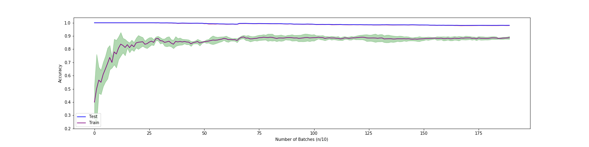

# Vocal Recognizer 

---

In this project, we are going to follow step-by-step the creation of a Machine Learning Model.
Our goal is to recognize the person that is talking in real-time based on the training data given to the model.
For this reason, we chose to use 2 audio tracks that we found on Youtube long about 20 minutes.

The first one is the one we called Prince in the Python Code.
* https://www.youtube.com/watch?v=zKtdVseMNAM
* https://drive.google.com/file/d/1RhP0Yf6Ez62lEtv4R66VUbBHl4T0-oxG/view?usp=sharing

The second one is the one we called Bedroom in the Python Code.
* https://www.youtube.com/watch?v=6nA_Je_8i-U&t=1168s
* https://drive.google.com/file/d/1aZo9ahS9YiaGNVc5dOrQPFm29Kyb5VDM/view?usp=sharing

You can either download it on your own using an online converter and the Youtube video link or directly from our Google Drive.
In both cases remember to put them in a directory called Audio or if you prefer to change the code and choose another one.

---

## Loading Data from Youtube videos

We downloaded these two videos using an online converter to WAV file to have easier data usage.

After we downloaded the files we imported into Python using Scipy through its module called wavfile.

```python
from scipy.io import wavfile

fs, prince = wavfile.read(f'{root}Audio/prince.wav')
fs, bedroom = wavfile.read(f'{root}Audio/bedroom.wav')

```

The method returns both the frequency of the audio and the audio itself.
In our case, the frequency was 44100 Hz.
Instead, the Audio length was about 52 million so the next thing we are going to do is reduce these to well-fit the Model.

---

## Data Scaling

Before starting the real adjustment we reduced both the tracks to be 20 minutes long.

```python

bedroom_difference = bedroom.size - 20*60*fs
bedroom = bedroom[bedroom_difference:]
prince_difference = prince.size - 20*60*fs
prince = prince[prince_difference:]

```
That expression "20 * 60 * fs" is used get the difference between the original file length and 20 minutes which is our goal, 20 * 60 to get the total amount of seconds and then we multiplied by the frequency.

The first thing that we've looked at is the volume of the tracks and we found out that one is louder than the other so we applied a scaler from the sklearn library to scale the raw audio.

Why we couldn't just use the original volume? 
The reason is because the Model will predict with high accuracy basing on the volume of the speaker and not basing on the tone. 

```python
from sklearn.preprocessing import StandardScaler

scaler = StandardScaler()

prince = scaler.fit_transform(prince.reshape(-1, 1)).flatten()
bedroom = scaler.fit_transform(bedroom.reshape(-1, 1)).flatten()
```

Next, you can look at the plots visualizing the Audio before and after the scaling process.

  ## Raw


__Offset between blue and orange track for visualization purpose__ 

  ## Scaled


---

# Data Filtering

Now, look at a little portion of the Scaled Data.


As you can see it is very irregular and this may cause the Model to not be able to fit adequately, so we are going to apply to the entire data a *Gaussian Filter* using Scipy, before doing that we need to make the track have its mean value to 0 and then to overturn the negative values over the X-axis which we did use *np.mean* and *np.abs*.

```python

from scipy.ndimage import gaussian_filter

filtered_prince = gaussian_filter(np.abs(prince - np.mean(prince)), 100)
filtered_bedroom = gaussian_filter(np.abs(bedroom - np.mean(bedroom)), 100)

```

This is the result in the same portion of the file.


Now we are close to the actual training time, we need to do only a few more things, in fact, our file is very large right now so we have to reduce it, lastly, we need to divide it into small batches.

---

# Data Reduction 

We are going to reduce the dimension of the file and we are going to divide it into batches, so how do we do it?
First let's focus on the audio itself, during a talk, there are breaks between each word which are useless in term of recognizing who is talking so we need to remove all the pauses that are inside a 20 minutes talk.
To do so we define a variable called cut_silence and set it to a value that is able to remove the silence and at the same time keep all the words intact.
We then make a mask, which is basically an array with the same shape of the original audio filled with 0 and 1, 0 where the audio is less than the threshold and 1 when it's greater than it.
Once we have our mask we apply it to the original audio to remove the silence between each word.

```python

  data_prince = pd.Series(np.where((filtered_prince>cut_silence)==1, prince, None))
  data_bedroom = pd.Series(np.where((filtered_bedroom>cut_silence)==1, bedroom, None))

  data_prince = data_prince.dropna(axis=0)
  data_bedroom = data_bedroom.dropna(axis=0)
  
  data_prince = data_prince.as_matrix()
  data_bedroom = data_bedroom.as_matrix()

  
  data_prince = np.asarray(data_prince, dtype=np.int16)
  data_bedroom = np.asarray(data_bedroom, dtype=np.int16)

```

So let's talk about the code:
In the first part we created a *Pandas Series* that is going to help us removing None values from the array.
We used Numpy's method *where* to place the original value if the filtered audio is greater than the threshold instead we are placing None if it's not.
After this we have an array that looks like this: ``` [..., 5.3, 4,6, None, None, None, 8.3, 1.2, 0.4, None, ...] ```

So we are using a Series method called *dropna* to remove all the *None* values from it.
This image will show the correlation between the Audio and the Mask.
Where you see the blue line(Mask) high it means that the result will keep the corresponding of the orange track, instead, the orange part will be canceled if the blue line is low.


The next instruction is used to convert our Series back to a *numpy array* with datatype equals to *16bit*.
Why do we need it to be 16 bit instead of 64?
It's because our original audio is 16 bit.

Just using this mask our original audio reduced from 20 to 16 minutes, big difference!
We saved about 10 million values from our original array, this will heavily reduce the time used to compute this massive array. 

---

# Data Batching 

Now that we have our data ready for the training we need to divide it into batches.
We decided to create *batches 0.5 seconds long* but we could have decided to have 2 seconds or 1 seconds.
The problems with batches of 2 or 1 seconds are the dimension of the batch itself and the total number of batches that, in this case. is not big enough to allow a good training.
In our opinion, 0.5 seconds is the right choice to have an large number of batches each of them with an acceptable quantity of information.

Let's get into the code.

```python
  batch_size = batch_seconds*fs  

  data_prince = data_prince[:-(data_prince.size%batch_size)]
  data_bedroom = data_bedroom[:-(data_bedroom.size%batch_size)]
  
  size_batch_prince = int(len(data_prince) / batch_size)
  size_batch_bedroom = int(len(data_bedroom) / batch_size)
  
  data_prince = data_prince.reshape(-1, batch_size, order='C')
  data_bedroom = data_bedroom.reshape(-1, batch_size, order='C')
  
  X_a = np.zeros([size_batch_a, cut_frequency])
  for i in range(size_batch_a):
    X_a[i, :] = reduce_batch(data_prince[i, :], fs, cut_frequency)
  
  X_b = np.zeros([size_batch_b, cut_frequency])
  for i in range(size_batch_b):
    X_b[i, :] = reduce_batch(data_bedroom[i, :], fs, cut_frequency)

```

Cover this step by step:

` batch_size = batch_seconds*fs `

Starting from the top we are defining a new variable called *batch_size* which is defined by ` batch_seconds * fs `, so in our case *batch_seconds* is 1 and *fs* (sampling rate) is 44 kHz so batch_size will be just 44100.
This is used to match the size of the input data to be multiple of *batch_size* so we can have an even amount of batches.

```
  data_prince = data_prince[:-(data_prince.size%batch_size)]
  data_bedroom = data_bedroom[:-(data_bedroom.size%batch_size)]
```

Then we remove the difference between the original size and the one we are trying to achieve.

```
  size_batch_prince = int(len(data_prince) / batch_size)
  size_batch_bedroom = int(len(data_bedroom) / batch_size)
```

After this, we save the number of batches that we are going to have trough this formula ` int(len(data_prince) / batch_size) `.
We are making it Integer because we are going to use it to set as a dimension to an array so it needs to be Int instead of Float.

```
  data_prince = data_prince.reshape(-1, batch_size, order='C')
  data_bedroom = data_bedroom.reshape(-1, batch_size, order='C')
```
   
Now we reshape the array to get a matrix with the following shape `(Number of Batches, Batch Size)`.

```
  X_a = np.zeros([size_batch_a, cut_frequency])
  for i in range(size_batch_a):
    X_a[i, :] = reduce_batch(data_prince[i, :], fs, cut_frequency)
  
  X_b = np.zeros([size_batch_b, cut_frequency])
  for i in range(size_batch_b):
    X_b[i, :] = reduce_batch(data_bedroom[i, :], fs, cut_frequency)
```

Using these *For Loops* we are looping over all the batches and we are calling a function called *reduce_batch* and giving it the batch, the frequency, and the cut_frequency.
This particular threshold is used to remove the undesired frequency that is just useless for the training process.
These two cuts are what we call *Hyperparameter*, it means that they are variable and can be modified in order to upgrade the performances of the model.
A big part of the development is giving the right values to these hyperparameters so that the accuracy raise.

Let's dig into this function.

```python
  frequence, time, spectre = signal.spectrogram(batch, fs) 
  spectre = spectre[:cut_frequency, :]
  mean_array = np.mean(spectre, 1)
  return mean_array
```

We are taking out of the audio the amplitude of each frequency.
To do so we are using once again a Scipy method called *signal.spectrogram* that returns an array with the frequency, an array with times and a matrix with the amplitude of each frequency during time.
We are using `cut_frequency` to get away all the useless frequencies that are never touched by the human voice and we put them into an array.
Then we get mean values instead of the matrix because it's more useful to have an image of the mean value of each frequency involved in 1 second of registration.
In the end, we return a 1-D array that looks like the third row of the next Image, on the X axis you can find Frequences and on the Y axis the mean value.


Lastly, in the main function, we concatenate the two batches together, using numpy's method *concatenate*, to get what we called the X and y (assigning 0 to prince and 1 to bedroom) that are going to fit into the model.

```python
  X = np.concatenate([X_a, X_b])
  y_a = np.zeros(size_batch_a)
  y_b = np.ones(size_batch_b)
  y = np.concatenate([y_a, y_b])
  
  return X, y
```

So this is the last part of this module before we go through the process of training.

---

# ML Model

So as I said we are using Scikit-Learn to help us in the project of training.
Let's start from the model we've chosen to use, a *Support Vector Machine*, and we have initialized it like this: 
```python 
from sklearn.svm import SVC

svc = SVC(gamma=0.06, C=10000)  
```

So how does a Support Vector Machine (*SVM*) works?
The following image can help us:


Let's start talking about the left one we then move to the right.
the *SVM* initially places a *Hyperplane* and tries to place it to separate, *linearly* or *non-linearly*, inputs of each class.
A Hyperplane can be in 2-d or in Multi Dimension, in our case we have about 15 dimensions.
How is SVM able to do so? Take a look at the next image:


The two classes are `NO` on the left side and `YES` on the right one.
What are these *Support Vector*? 
They are just the closest input point to the Hyperplane, they are so important because all the SVM algorithms are based on this distance *SupportVector <---> Hyperplane*. 

---

# Training Time

We finally reached the final step, in this paragraph we are going through the process of *Training* and we'll also be seeing the importance of the *Number of batches* and if this number influences the final result.

We are going to use once again *Sklearn*'s method called `Cross Validate`  to train our model.
What are the advantages of using this method? Why couldn't you use the typical `fit`?

The reason is that when you use *fit* you have to manually divide `X` and `y` into *train and test* so that the accuracy you get isn't influenced by the training data.
This method does this thing automatically and not just once but multiple times, as we'll see it's a parameter of the function `cross_validate`, changing the position every time.


The estimations are the times we want it to change the position of *train and test*.
The blue rectangles are the Training Portions of X and the green ones are the Test Portions of X.

Now let's talk about the importance of the *Number of batches*.
To find the perfect number of batches we created a function called `graph` that train the model every time with a larger X and y every time. 
This function returns the mean values for train and test.
this is what we see if we plot them:



The opaque areas near the blue and purple lines are the variance of the line, so it means that the real value can be in between the upper and the lower limit of them.
The less opaque they are, the more accurate the lines are.
Looking closely at the plot we can see that the accuracy grows the more data you give to the model.
This is why we decided to use smaller batches to have more of them to feed the model.

At the end, our best model reached:

```Accuracy on Train : 98% +/- 0.1%```

```Accuracy on Test  : 88% +/- 1%```

---

__Project made by Lorenzo Bartolini and Amos Staropoli from Gobetti-Volta School, Bagno a Ripoli (Florence).__

---